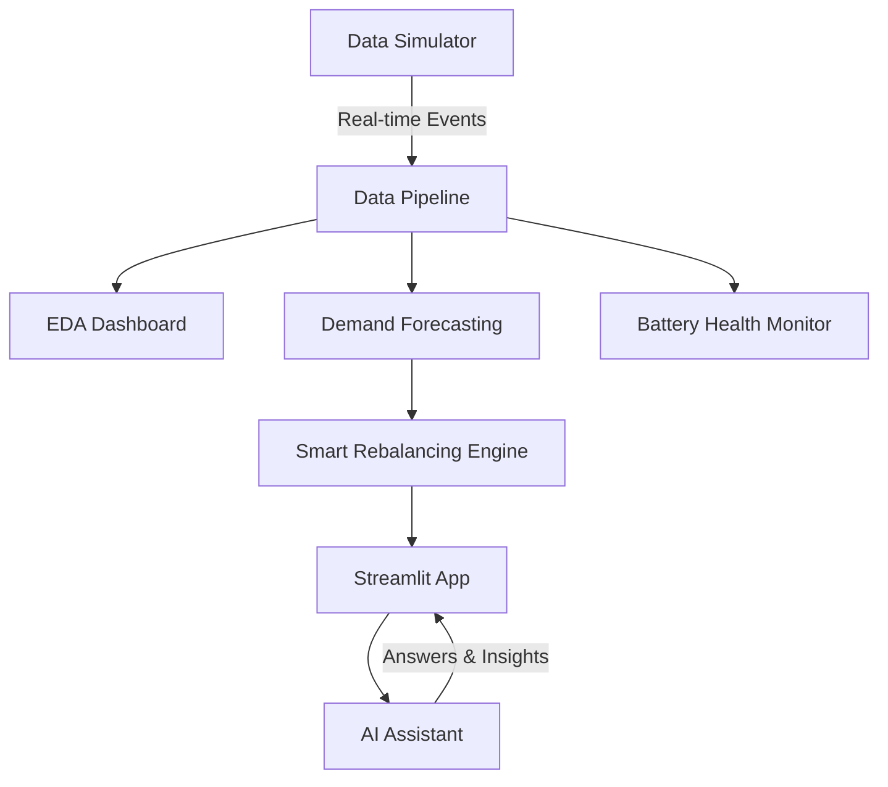

<<<<<<< HEAD
# Smart EV Fleet Optimization & Demand Forecasting System
=======
<<<<<<< HEAD
# ⚡ Smart EV Fleet Optimization & Demand Forecasting System
=======
<<<<<<< HEAD
#  Smart EV Fleet Optimization & Demand Forecasting System
>>>>>>> cda1056d9645342387466d03c481ef633a409b6a

[](https://www.python.org/)
[](https://streamlit.io/)
[](https://groq.com/)

**Building the future of urban mobility, one ride at a time.**

Imagine a city where you never have to worry about finding a charged electric vehicle. This project is a comprehensive Data Science and Operations Research system designed to make that a reality for micro-mobility platforms like **Yulu**. By predicting demand before it happens and intelligently rebalancing the fleet, we ensure the right vehicle is in the right place at the right time.

---

## How It Works



---

## What Changes for the Better?

### 1. Seeing the Future (Demand Forecasting)
Instead of reacting to empty docking stations, we predict them. Using advanced machine learning (XGBoost), our system analyzes past trends to forecast zone-wise demand for the next hour.
*   **The Result:** We know where bikes will be needed before the rush starts.

### 2. Smarter Moves (Operations Research)
Knowing the demand is only half the battle; meeting it is the other. We use the **Hungarian Algorithm** to solve the complex puzzle of fleet allocation. It calculates the most efficient way to move available bikes to high-demand zones while minimizing travel distance.
*   **The Result:** Fewer lost rides, satisfied users, and reduced operational costs.

### 3. No More Dead Batteries (Predictive Maintenance)
A dead bike is a useless bike. Our Random Forest model constantly monitors fleet telemetry to identify vehicles at risk of critical battery failure.
*   **The Result:** Maintenance teams can swap batteries proactively, keeping the fleet healthy and active.

### 4. Talk to Your Data (GenAI Assistant)
You shouldn't need to be a data scientist to understand your fleet. We've integrated a powerful **GenAI Assistant** (powered by Groq/Llama-3) that lets you ask plain English questions like, *"Why is the downtown zone running low on bikes?"*
*   **The Result:** Instant, data-backed insights for everyone.

### 5. Live Simulation
To demonstrate the system in action, we've included a real-time simulator that streams ride events. Watch as the dashboard updates, the model predicts, and the fleet adapts—live.

---

## Tech Stack
We built this using a robust stack of modern tools:
- **Core Logic:** Python, Pandas, NumPy
- **Machine Learning:** Scikit-learn, XGBoost
- **Optimization:** Scipy
- **Visualization:** Streamlit, Plotly, Seaborn
- **AI Integration:** Groq API (Llama3-70b)

---


---

## Getting Started

Ready to see it in action? Follow these simple steps.

### 1. Clone & Setup
First, get the code and install the necessary tools:
```bash
pip install -r requirements.txt
```

### 2. Configure Your AI Assistant
To enable the GenAI features, you'll need an API key from Groq. Create a `.env` file in the root directory and add it there:
```env
GROQ_API_KEY=your_groq_key_here
```

### 3. Run the System
**Step A: Simulate the City (Optional)**
Start the real-time simulation to generate live ride events:
```bash
python src/simulation.py
```

**Step B: Launch the Dashboard**
Fire up the application:
```bash
streamlit run app.py
```

---

## The Impact
This isn't just about code; it's about results.
- **20% Fewer Lost Rides:** By predicting demand, we ensure bikes are available when users need them.
- **Longer Lasting Batteries:** Proactive alerts prevent deep discharge, extending the life of the fleet.
- **Empowered Teams:** Managers can make data-driven decisions without needing to write a single line of SQL.

---
*Designed with ❤️ for Yulu-Aligned Fleet Operations.*

---

## Deployment

Ready to go live? Deploying to the cloud is easier than you think.

### Deploying to Streamlit Community Cloud

1.  **Push to GitHub**: Make sure your latest code is safe in your GitHub repository.
2.  **Sign In**: Head over to [share.streamlit.io](https://share.streamlit.io/) and log in.
3.  **Create App**: Click **"New app"**.
4.  **Connect**:
    *   **Repository**: Select your repo (e.g., `AI-Driven-EV-Fleet-Optimization...`).
    *   **Branch**: `main`.
    *   **Main file path**: `app.py`.
5.  **Add Secrets**:
    *   Go to **Advanced settings** in the deployment dashboard.
    *   Paste your API key in TOML format:
        ```toml
        GROQ_API_KEY = "your_actual_api_key_here"
        ```
6.  **Launch**: Click **"Deploy!"**.

Once the balloons fly, your app will be live for the world to see!

[**🚀 Click Here to View Live Demo**](https://ai-driven-ev-fleet-optimization-for-urban-micro-mobility-dxfxm.streamlit.app/)


