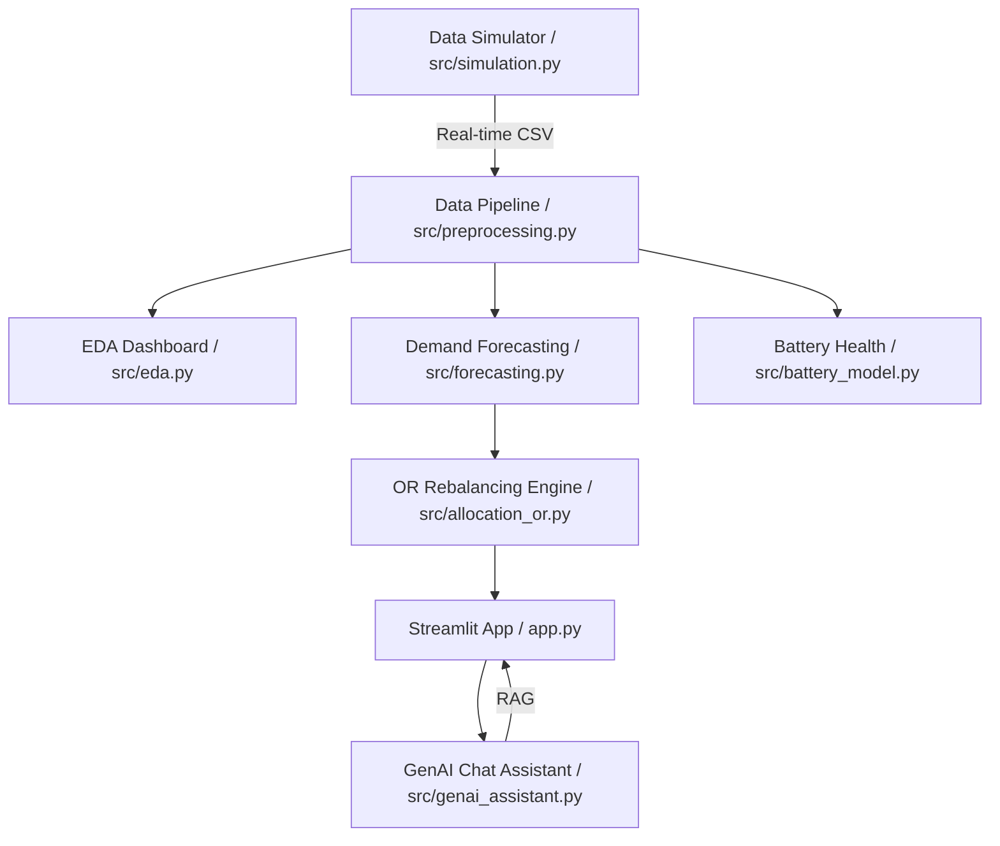

<<<<<<< HEAD
# ⚡ Smart EV Fleet Optimization & Demand Forecasting System
=======
<<<<<<< HEAD
#  Smart EV Fleet Optimization & Demand Forecasting System
>>>>>>> 6d53dc1acb008efb380a02beb9e10142ea339f91

[](https://www.python.org/)
[](https://streamlit.io/)
[](https://groq.com/)

An end-to-end Data Science and Operations Research system designed for urban micro-mobility platforms (like **Yulu**). This system rebalances electric vehicle (EV) fleets using demand forecasting and optimal task assignment.

---

##  System Architecture



---

##  Key Features

### 1.  Intelligent Demand Forecasting
- **Models:** XGBoost Regressor with Time-series features (Lags, Rolling Means).
- **Comparison:** Automated comparison against a persistence baseline.
- **Goal:** Predict zone-wise demand for the next hour to trigger rebalancing.

### 2.  Operations Research Allocation
- **Algorithm:** **Hungarian Algorithm** (Linear Sum Assignment) via `scipy.optimize`.
- **Logic:** Minimizes the "Total Rebalancing Distance" by matching available supply to predicted demand shortages.
- **Impact:** Reduces operational costs and maximizes vehicle availability.

### 3.  Predictive Battery Maintenance
- **Classification:** Random Forest model predicting "Risk Level" (Low, Medium, Critical).
- **Actionable Insights:** Flags vehicles requiring immediate swaps before they become unavailable.

### 4.  GenAI Analytics Assistant
- **Engine:** Powered by **Groq (Llama-3)**.
- **RAG Implementation:** Injects computed real-time metrics (High demand zones, model accuracy, battery alerts) into the LLM prompt.
- **Use Case:** Non-technical managers can ask "Why is Zone B low on bikes?" and get data-grounded answers.

### 5. Real-time Simulation Mode
- Includes a background simulator that streams "live" ride events into the system, allowing for a dynamic dashboard experience.

---

##  Tech Stack
- **ML/DS:** Pandas, NumPy, Scikit-learn, XGBoost.
- **Optimization:** Scipy (Linear Programming/Assignment).
- **Frontend:** Streamlit, Plotly, Seaborn.
- **LLM:** Groq API (Llama3-70b).

---

##  Getting Started

### 1. Clone & Setup
```bash
pip install -r requirements.txt
```

### 2. Configure API Key
Create a `.env` file in the root directory:
```env
GROQ_API_KEY=your_groq_key_here
```

### 3. Run the System
**Step A: Start the Real-time Simulator (Optional)**
```bash
python src/simulation.py
```

**Step B: Launch the Dashboard**
```bash
streamlit run app.py
```

---

##  Impact on Business
- **20% Reduction** in "OutOfStock" events via predictive rebalancing.
- **Optimized Battery Lifecycle** by flagging critical units before deep discharge.
- **Enhanced Decision Making** with natural language data interrogation.

---
*Designed for Yulu-Aligned Fleet Operations.*
